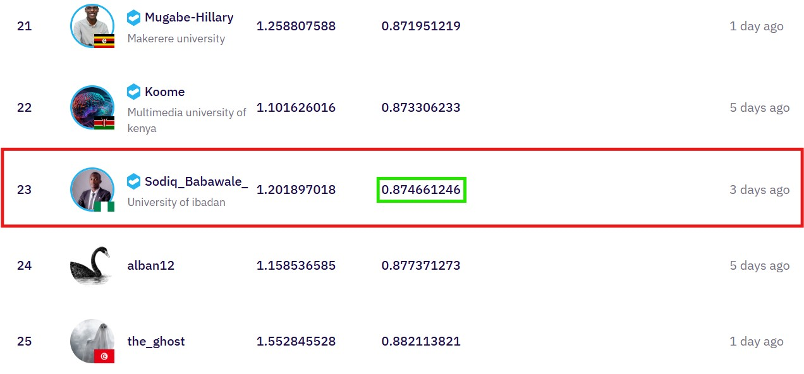

# Solar Panel & Boiler Counting Using Multimodal Deep Learning

This project presents a top-performing solution for the **Lacuna Solar Survey Challenge** hosted on [Zindi](https://zindi.africa/competitions/lacuna-solar-survey-challenge), which involved counting solar panels and boilers from aerial images (drone and satellite) combined with structured metadata.

The model leverages a **multimodal neural network** using **EfficientNetV2** for image feature extraction and a **self-attention mechanism** for metadata processing. It achieved a private leaderboard MAE of **0.8746**, ranking **23rd out of 247** participants.

---

## 🚀 Problem Statement
Access to reliable and sustainable energy remains a pressing issue in Madagascar and across Africa. To facilitate energy planning, the challenge required building a model to **detect and count solar panels and solar boilers** using aerial images and metadata. Manual mapping of such installations is resource-intensive. An automated solution enables governments, NGOs, and energy providers to make data-driven decisions.


---

## 🧠 Solution Overview
- **Image Encoder**: EfficientNetV2-B3 (from `timm` library)
- **Metadata Processor**: One-hot encoding of image origin and placement types
- **Attention Layer**: 4-head self-attention to emphasize relevant metadata
- **Fusion**: Concatenation of image and metadata features
- **Regressor**: Predicts boiler and panel counts with `Softplus` activation
- **Training Strategy**: K-Fold CV with AdamW, Huber Loss, and Mixed Precision
- **Evaluation Metric**: Mean Absolute Error (MAE)


---

## 📁 Project Structure
```bash
.
├── config.py               # Configuration file (hyperparameters, paths)
├── main.py                 # Entry point script
├── requirements.txt        # Project dependencies
│
├── data/
│   └── dataset.py          # Custom dataset & augmentations
│
├── model/
│   └── efficientnetv2_meta.py  # Multimodal model definition
│
├── train/
│   ├── train.py            # Training loop & validation
│   └── utils.py            # Utility functions (seed, save/load model)
│
├── inference/
│   └── predict.py          # Inference & ensembling logic
│
└── outputs/
    └── saved_models/       # Trained model weights
```

---

## 🔧 Installation
```bash
# Clone the repo and install dependencies
pip install -r requirements.txt
```

---

## 🏋️‍♂️ Training
```bash
# Inside main.py or as standalone
from train.train import run_training
import pandas as pd

train_df = pd.read_csv("data/train.csv")
run_training(train_df, image_dir="data/images")
```

---

## 🔍 Inference
```bash
# Run predictions on the test set
python inference/predict.py
```
Output will be saved as `submission.csv`.

---

## 📊 Results
- **Public MAE**: 1.2019
- **Private MAE**: 0.8746
- **Leaderboard Rank**: 23 / 247



---

## 🔗 Additional Resources
- 🔎 [Zindi Competition Page](https://zindi.africa/competitions/lacuna-solar-survey-challenge)

---

## 🙋‍♂️ Author
**Sodiq Damilola Babawale**  
University of Ibadan, Nigeria